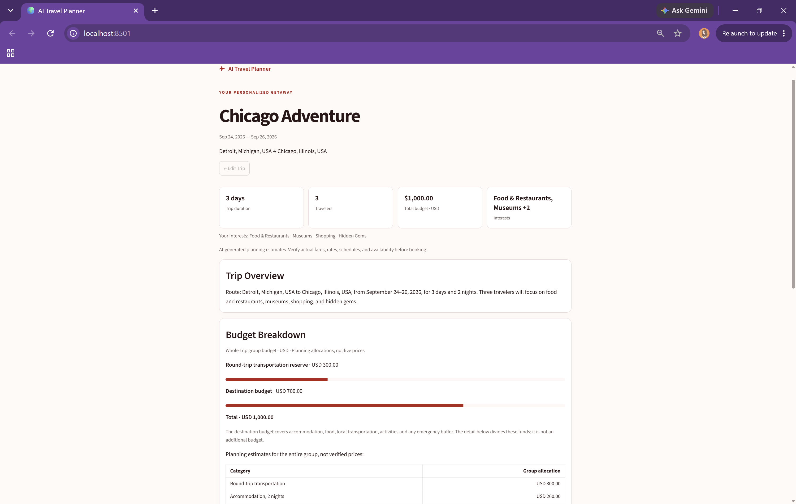
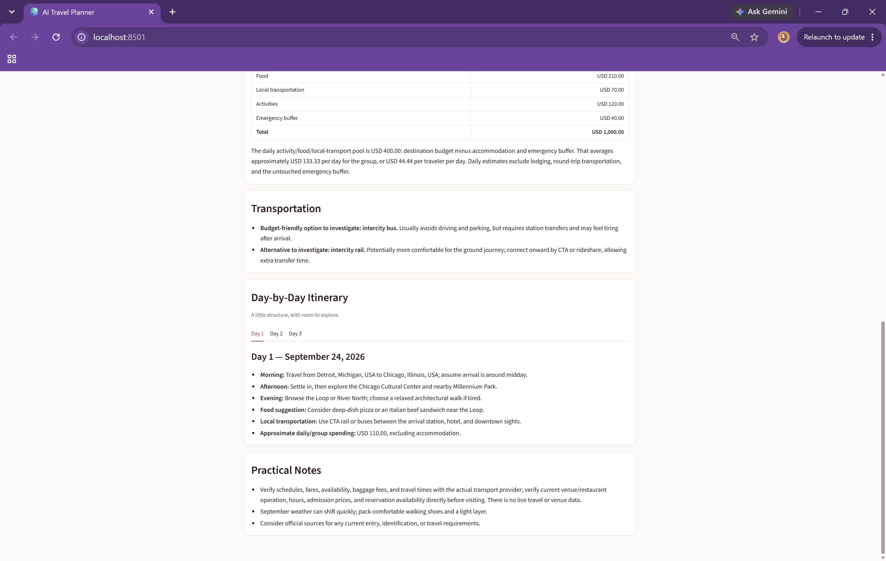

# AI Travel Planner

An AI-powered travel planning application that creates personalized, budget-aware itineraries from your origin, destination, travel dates, traveler count, total budget, transportation reserve, and interests. Built with Python and Streamlit, it combines local city search and deterministic budget calculations with OpenAI-generated travel guidance in a focused, responsive interface.

## Project Preview



*Personalized trip summary with travel details and a clear budget breakdown.*



*Transportation guidance and an AI-generated day-by-day itinerary tailored to the trip.*

## Features

- **Personalized itineraries:** travel suggestions informed by your route, dates, group size, budget, and selected interests.
- **Global city autocomplete:** locally ranked city suggestions for both origin and destination, with supplemental airport codes.
- **Trip preferences:** departure and return dates, automatic inclusive trip duration, 1–20 travelers, a total group budget in USD, and an adjustable transportation reserve.
- **Interest-based planning:** 18 interests, including food, museums, nature, architecture, family activities, and local experiences.
- **Budget breakdown:** calculated category allocation bars alongside the itinerary's AI-generated budget table.
- **Organized results:** trip overview, transportation guidance, morning/afternoon/evening activities, food suggestions, local transportation, approximate daily spending, and practical notes.
- **Responsive presentation:** a warm red/blush interface, day tabs for trips up to seven days, and expandable day sections for longer trips when the output matches the expected format.
- **Session continuity:** edit trip inputs or return to the last itinerary without automatically generating another plan.
- **Error handling:** input validation before generation and user-facing messages for missing configuration, unavailable city suggestions, API failures, and incomplete responses.

## How It Works

**Trip preferences → location validation → deterministic budget calculations → OpenAI itinerary generation → structured presentation**

1. Select origin and destination cities from autocomplete, enter your dates and group budget, and choose at least one interest.
2. The app checks that cities are selected, the return date is after departure, and the budget is positive. Trip duration includes both travel days.
3. Python calculates the transportation reserve, remaining destination budget, and baseline category allocations.
4. The OpenAI Responses API receives the trip details and budget constraints and generates a Markdown itinerary.
5. The presentation layer organizes recognized sections into cards and day controls. Unexpected formats retain their Markdown content instead of being discarded.

Budget arithmetic and location selection are deterministic. Activities, transportation suggestions, practical advice, and the itinerary's detailed allocation table are AI-generated planning estimates.

## Architecture

| Module | Responsibility |
| --- | --- |
| `app.py` | Streamlit inputs, validation, session state, generation flow, and navigation between inputs and results. |
| `planner.py` | Inclusive date calculation, itinerary instructions, OpenAI Responses API integration, and sanitized API errors. |
| `budget.py` | Transportation reserve, destination budget, and baseline category calculations. |
| `presentation.py` | Result cards, allocation bars, conservative Markdown section parsing, day tabs/expanders, and content-preserving fallbacks. |
| `location_model.py`, `location_search.py` | Immutable city/airport records and ranked search against the bundled local index. |
| `location_widgets.py`, `location_runtime.py` | Autocomplete controls, selected-city state, and compatible loading of location modules. |
| `airport_data.py`, `scripts/build_location_index.py` | Preparation of location data and conservative city-to-airport associations. |
| `styles.css`, `.streamlit/config.toml` | Responsive styling and Streamlit theme configuration. |
| `tests/` | Budget, location, planner, presentation, and interface regression tests. |

The SQLite file in `data/locations/` is a local search index, not a user or saved-trip database. The separate `destination_lookup.py` and `scripts/check_locations.py` provide explicit Nominatim diagnostics; the application does not use them for autocomplete.

## Tech Stack

- **Python 3.10+** with standard-library date handling, dataclasses, and SQLite access.
- **Streamlit** and **streamlit-searchbox** for the interface and autocomplete.
- **OpenAI Python SDK / Responses API** for itinerary generation.
- **GeoNames and OurAirports snapshots** for local city and airport information.
- **CSS and Streamlit theme configuration** for presentation.
- **Requests** for dataset preparation and standalone geocoding diagnostics.
- **unittest, unittest.mock, and Streamlit AppTest** for automated tests; optional pytest runner and Playwright browser checks.

Runtime dependencies are listed in [requirements.txt](requirements.txt).

## Location Search

Typing searches the bundled GeoNames-derived SQLite index without making external requests. Autocomplete starts at three characters, uses a 300 ms debounce, and returns up to five suggestions. Ranking considers exact names, prefixes, aliases, population, and administrative/airport evidence. State and country qualifiers help disambiguate matches.

OurAirports data supplies supplemental airport-code hints, such as `Chicago, Illinois, USA · MDW / ORD`. Associations are prepared using names, country, geographic proximity, and airport eligibility checks.

**A selected location remains a city**, with airport metadata stored separately. Airport codes do not select a required airport or establish that a route currently operates. Only clean city labels are sent to the itinerary planner.

See [LOCATION_SYSTEM.md](LOCATION_SYSTEM.md) for ranking, coverage, state handling, and diagnostic details.

## Budget Planning

The entered budget covers the **entire group and whole trip**, in USD:

```text
Total trip budget
  ├─ Round-trip transportation reserve
  └─ Destination budget
       ├─ Accommodation
       ├─ Food
       ├─ Local transportation
       └─ Activities
```

The deterministic calculator reserves the selected percentage for round-trip transportation, then assigns 40% of the remainder to accommodation, 25% to food, 15% to local transportation, and the remaining amount to activities. Rounding is reconciled in the activities allocation.

For example, **USD 1,000 with a 30% reserve** produces USD 300 for transportation and USD 700 for the destination: USD 280 accommodation, USD 175 food, USD 105 local transportation, and USD 140 activities.

The AI-generated table may redistribute the destination budget across those categories **and an emergency buffer**. The deterministic calculator does not create a separate buffer. The prompt instructs the model to preserve the reserve and total, and to exclude lodging, round-trip transportation, and the buffer from daily activity/food/local-transport spending. Generated arithmetic is not independently enforced by the presentation layer and should be reviewed.

The bars and table describe the same funds, not additional budgets. All amounts are planning allocations—not live fares, rates, or proof that a trip is affordable.

## Getting Started

You need Git, Python 3.10 or newer, and OpenAI API access for itinerary generation. Generation requires an internet connection and may incur API charges; city autocomplete runs locally.

### 1. Clone the repository

```bash
git clone https://github.com/krishna24-05/AI-Travel-Planner.git
cd AI-Travel-Planner
```

### 2. Create and activate a virtual environment

**Windows PowerShell:**

```powershell
py -m venv .venv
.\.venv\Scripts\Activate.ps1
```

**macOS / Linux:**

```bash
python3 -m venv .venv
source .venv/bin/activate
```

If PowerShell blocks activation, use `.\.venv\Scripts\python.exe` in place of `python` in the commands below; activation is not required to use that interpreter.

### 3. Install requirements

```bash
python -m pip install -r requirements.txt
```

Keep `data/locations/cities.sqlite3` in place: it is required for autocomplete. If the prepared index is missing, follow the [dataset build instructions](data/locations/README.md). Rebuilding downloads source data when it is not already cached; normal application startup does not rebuild the index.

### 4. Configure the API key securely

Set `OPENAI_API_KEY` in the terminal that will launch Streamlit. These prompts accept the key without displaying it or embedding its value in shell history.

**Windows PowerShell:**

```powershell
$secureApiKey = Read-Host "OpenAI API key" -AsSecureString
$env:OPENAI_API_KEY = [System.Net.NetworkCredential]::new("", $secureApiKey).Password
Remove-Variable secureApiKey
```

**macOS / Linux (Bash):**

```bash
read -r -s -p "OpenAI API key: " OPENAI_API_KEY
printf '\n'
export OPENAI_API_KEY
```

If your shell is not Bash, enter `bash` first and run these commands and the launch command in that shell. For deployment, configure the environment variable through the hosting platform's secret manager.

The application reads the process environment directly. It does not automatically load `.env` files or read the key from Streamlit secrets.

### 5. Run Streamlit

```bash
python -m streamlit run app.py
```

Open the local URL printed by Streamlit, complete the trip preferences, and select **Craft My Trip**. Keep the same terminal session open so the app inherits the configured environment variable.

## Testing

The existing suite uses `unittest.TestCase` and Streamlit's `AppTest`. It can also be collected by **pytest**. With pytest available in your development environment, run from the project root:

```bash
python -m pytest tests -q
```

Pytest is an optional development tool and is not included in `requirements.txt`. If needed, install it separately with `python -m pip install pytest`. No dependency-file change is required. Alternatively, use the existing standard-library runner:

```bash
python -m unittest discover -s tests -v
```

Tests cover location ranking and airport associations, budget reconciliation, invalid-trip rejection, mocked API behavior, output fallbacks, and input preservation through Edit Trip. OpenAI and external geocoding calls are mocked; these tests require no real API key and spend no OpenAI credits. Planner tests currently import `httpx2`, which is supplied by the OpenAI SDK version used in the development environment.

Optional browser checks require a separately provisioned Playwright development environment and local Google Chrome:

```bash
python -B scripts/check_streamlit_startup.py
python -B scripts/check_presentation_ui.py
```

These scripts start temporary local servers and check autocomplete or seeded results, including narrow layouts. They do not generate a real itinerary. Screenshots are written to the ignored `.artifacts/` directory.

## Data Sources

- **[GeoNames](https://www.geonames.org/):** city, administrative-region, country, and alternate-name data, licensed under **[CC BY 4.0](https://creativecommons.org/licenses/by/4.0/)**. Preserve attribution, the license link, and notice of modifications when redistributing the derived data.
- **[OurAirports](https://ourairports.com/data/):** airport metadata released into the **public domain**. Source attribution is retained in the application and dataset documentation.

The prepared index filters populated places, normalizes names, joins region/country labels, and associates eligible airports with cities. See the [dataset documentation](data/locations/README.md) and [snapshot metadata](data/locations/metadata.json) for provenance, transformations, hashes, and refresh instructions.

## Limitations

- No live flight fares, hotel prices, booking availability, transport schedules, weather, maps, or real-time venue information.
- AI suggestions and generated budget estimates may be inaccurate. Verify prices, operating hours, availability, baggage rules, and travel times directly before booking or visiting.
- City and airport coverage depends on the bundled snapshot and conservative ranking/association rules; some places and serving airports may be absent.
- Rich section and option layouts depend on recognizable Markdown. Unrecognized output remains readable as Markdown.
- Trips are retained only in the active Streamlit session. There are no accounts, persistent saved trips, or booking/payment features.

## Future Improvements

Possible V2 work, not currently implemented:

- Live flight and hotel integrations with clearly sourced prices and availability.
- Weather context and map-based itinerary views.
- Persistent saved trips and authentication.
- Stronger validation of generated budget allocations and itinerary coverage.

## Security

Never commit API keys or other credentials. The repository's `.gitignore` excludes `.env`, `.env.*`, and `.streamlit/secrets.toml`; these exclusions do not protect secrets already committed or placed in other files.

The API key is read server-side from `OPENAI_API_KEY`. Trip details are sent to OpenAI to generate the itinerary, with `store=False` in the Responses API request. User-facing API errors avoid exposing raw SDK or configuration details.

## Project Status

An active portfolio project focused on personalized travel planning, reliable local location selection, transparent budget calculations, and a polished Streamlit experience. The current version is intended for demonstrations and planning exploration, with live-data integrations and persistent trip management left for future work.
